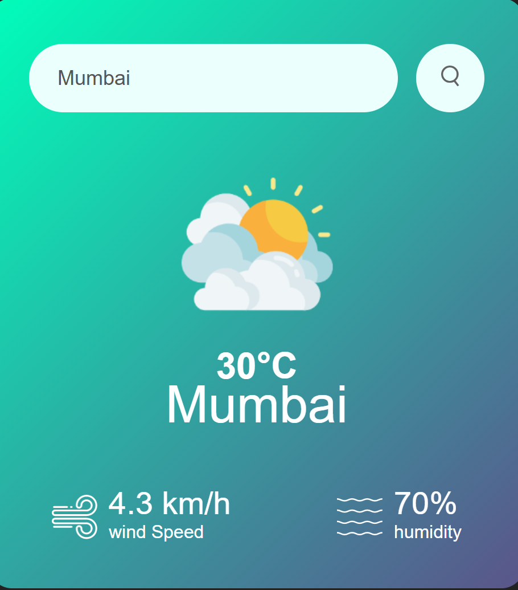
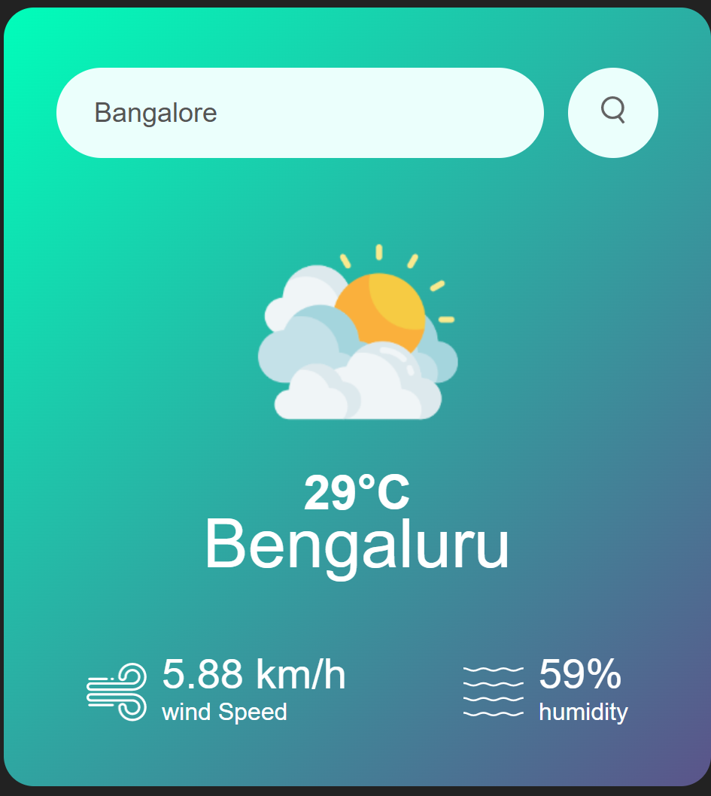

# 🌤️ Weather App

A responsive weather application built with **HTML**, **CSS**, and **JavaScript** that retrieves real-time weather information using the **OpenWeatherMap API**. Users can search for any city and instantly view the current temperature, humidity, wind speed, and weather conditions.

---

## 🚀 Features

* Search weather by city name
* Real-time weather information
* Temperature display
* Humidity display
* Wind speed display
* Dynamic weather icons
* Error handling for invalid city names
* Responsive user interface

---

## 🛠️ Tech Stack

* HTML5
* CSS3
* JavaScript (ES6+)
* Fetch API
* REST API
* OpenWeatherMap API

---

## 📂 Project Structure

```
Weather-App/
│── index.html
│── style.css
│── script.js
│── images/
│── README.md
```

---

## ⚙️ Getting Started

1. Clone the repository

```bash
git clone https://github.com/sindhutv/weather-app.git
```

2. Navigate to the project

```bash
cd weather-app
```

3. Get a free API key from OpenWeatherMap.

4. Replace the API key in your JavaScript:

```javascript
const apiKey = "YOUR_API_KEY";
```

5. Open `index.html` in your browser.

---

## 📸 Screenshots

## 📸 Screenshots

### Weather Search



### Weather Results



---

## 🎯 Learning Outcomes

* Working with REST APIs
* Fetch API and asynchronous JavaScript
* JSON parsing
* DOM manipulation
* Error handling
* Responsive web design

---

## 🔮 Future Improvements

* 5-day weather forecast
* Current location weather using Geolocation API
* Search history
* Dark mode
* Temperature unit conversion (°C / °F)

---

## 👨‍💻 Author

**Sindhu**
